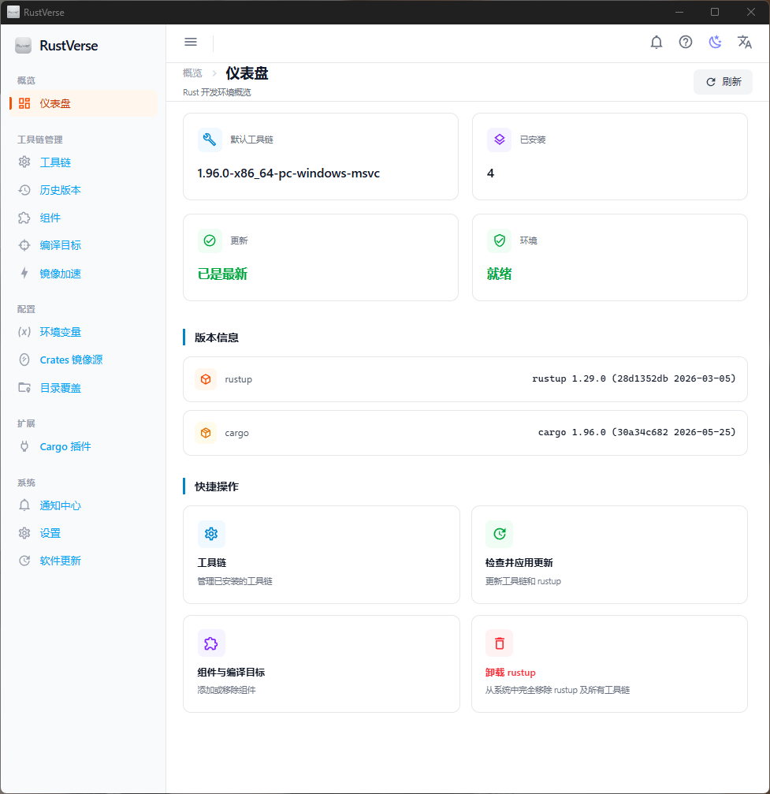
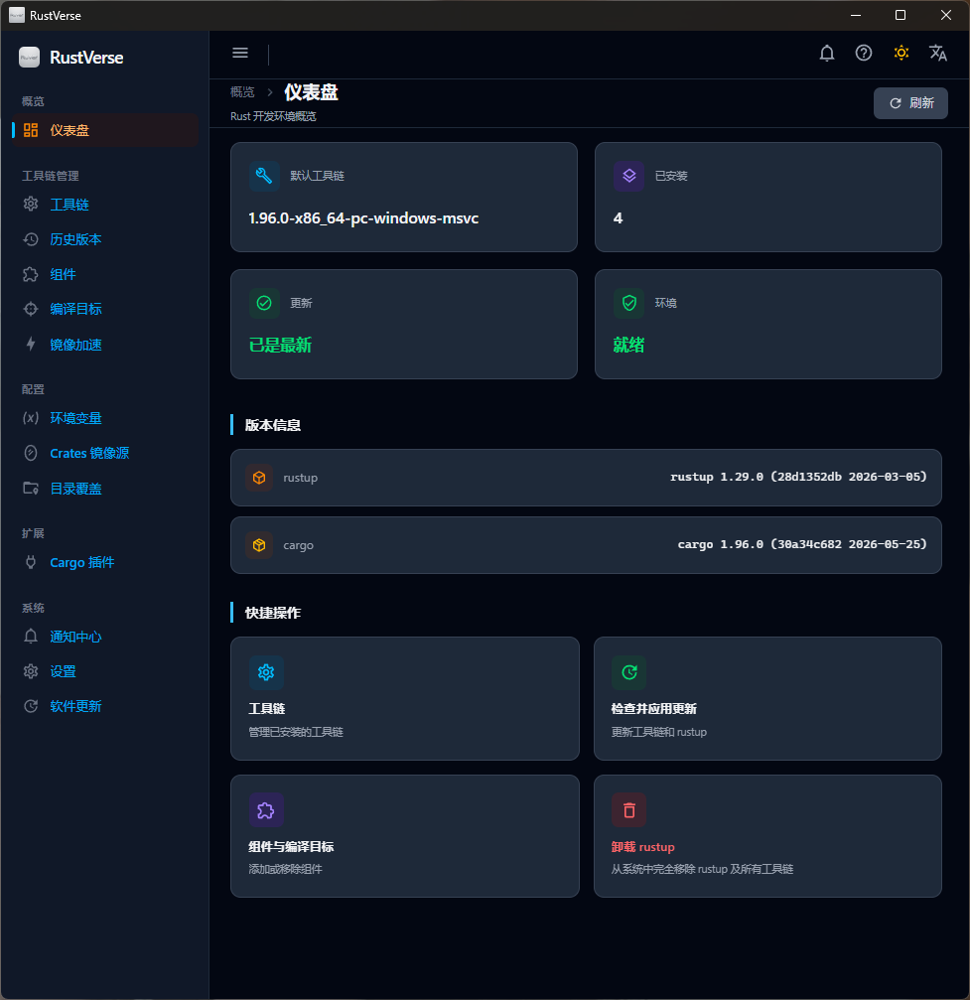
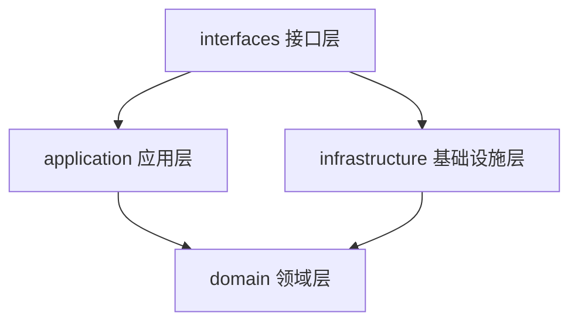

# RustVerse

> **v1.4.0** — Rust 工具链可视化管理器　|　[English Documentation](docs/README.en.md)

RustVerse 是一个跨平台桌面应用，提供对 Rust 工具链、组件、编译目标和 Cargo 插件的可视化一站式管理。基于 **Tauri 2** + **Vue 3** + **TypeScript** + **Tailwind CSS 4** 构建，融合 Rust 系统级性能与现代 Web 前端体验。

---

## 预览

> 📸 应用截图存放于 [`public/imgs/`](public/imgs/) 目录。如需替换截图，直接覆盖对应文件即可，无需修改文档结构。

| 浅色主题 | 深色主题 |
|:---:|:---:|
|  |  |  

---

## 核心功能

### 工具链管理
- 安装、卸载及切换 **stable** / **beta** / **nightly** 工具链
- 设置默认工具链，支持按目录覆盖（Directory Overrides）
- 内嵌历史版本浏览器，按渠道和日期范围筛选发行版

### 组件与目标管理
- 按工具链安装或移除 **rustfmt**、**clippy**、**miri** 等标准组件
- 安装、搜索及筛选交叉编译目标（targets），支持一键添加/移除

### 镜像源管理
- **Crates 镜像** — 集成 `crm` 工具，管理 crates.io 镜像源，支持自动最优切换及延迟测速
- **Rustup 镜像** — 管理 rustup 工具链下载镜像源，内置国内主流镜像源

### 环境变量与 PATH
- 查看、设置、持久化环境变量
- **CARGO_HOME** 自动加入系统 PATH，确保终端与 GUI 环境一致

### 更新中心
- 工具链更新支持流式进度展示，可分别更新 **rustup 自身**或**全部工具链**
- 应用在线自动更新，支持版本检查、下载进度、一键安装

### 通知与后台任务
- 全局通知中心，支持已读/未读标记、自动清理过期通知
- 后台任务管理，支持最小化到托盘继续运行

### 系统集成
- 系统托盘图标，支持最小化到托盘（可配置）
- 启动时自动检测 rustup / cargo 环境状态
- 国际化支持：**简体中文** / **English** 双语言
- 深色 / 浅色主题切换

---

## 技术栈

| 层级 | 技术 |
|:---|:---|
| 桌面框架 | Tauri 2.11 |
| 前端框架 | Vue 3.5 + TypeScript 6.0 |
| 构建工具 | Vite 8 |
| 样式方案 | Tailwind CSS 4 |
| 状态管理 | Pinia 3 |
| 国际化 | Vue I18n 11 |
| 后端语言 | Rust (edition 2024) |
| 数据库 | redb 4.1 (嵌入式键值存储) |
| 异步运行时 | Tokio 1.52 |

---

## 前置条件

| 依赖 | 最低版本 | 说明 |
|:---|:---|:---|
| [Node.js](https://nodejs.org/) | ≥ 20 | 前端运行时 |
| [pnpm](https://pnpm.io/) | ≥ 9 | 包管理器 |
| [Rust](https://rustup.rs/) | stable | 后端编译 |
| [rustup](https://rustup.rs/) | — | 运行时依赖（用于工具链管理） |
| [Tauri 2 系统依赖](https://tauri.app/start/prerequisites/) | — | 各平台构建工具链 |

---

## 快速开始

```sh
# 安装依赖
pnpm install

# 启动开发服务器
pnpm tauri dev
```

---

## 常用命令

| 命令 | 说明 |
|:---|:---|
| `pnpm tauri dev` | 启动开发服务器（热更新） |
| `pnpm tauri build` | 构建桌面安装包 |
| `pnpm test` | 运行前端单元测试（Vitest） |
| `pnpm test:e2e` | 运行端到端测试（Playwright） |
| `pnpm type-check` | TypeScript 类型检查 |
| `pnpm check` | Rust 后端 `cargo check` |
| `pnpm build` | 仅构建前端（用于 Vite 预览） |
| `pnpm bump` | 同步版本号至所有配置文件 |

---

## 构建与分发

```sh
pnpm tauri build
```

生成的安装包位于 `src-tauri/target/release/bundle/`：

| 平台 | 格式 |
|:---|:---|
| Windows | NSIS 安装包 (`.exe`)，含中/英文语言选择器 |
| macOS | `.dmg` / `.app` |
| Linux | `.deb` / `.AppImage` |

### 构建签名

应用默认启用自动更新签名。本地构建时，如果缺少签名密钥，请参考以下步骤：

```sh
# 1. 生成签名密钥对
node scripts/generate-signer-key.cjs

# 2. 设置环境变量
$env:TAURI_SIGNING_PRIVATE_KEY = "<粘贴私钥内容>"

# 3. 构建
pnpm tauri build
```

或临时禁用自动更新签名：将 `src-tauri/tauri.conf.json` 中 `bundle.createUpdaterArtifacts` 设为 `false`。

---

## 自动更新

应用集成 `tauri-plugin-updater`，支持签名验证的自动更新。

### 发布流程

```sh
# 完整发布（含版本号升级与签名）
node scripts/push-release.cjs [version]

# 预览模式（不执行实际变更）
node scripts/push-release.cjs --dry-run

# 跳过版本号升级
node scripts/push-release.cjs --skip-bump
```

CI 环境需配置 GitHub Secret：**`TAURI_SIGNING_PRIVATE_KEY`**。

---

## 项目结构

```
rustverse/
├── src/                              # 前端 (Vue 3 + TypeScript)
│   ├── components/                   # 通用 UI 组件 (18 个)
│   │   ├── BaseButton.vue            #   基础按钮
│   │   ├── ConfirmDialog.vue         #   确认对话框
│   │   ├── ProgressDialog.vue        #   进度对话框
│   │   ├── SplashScreen.vue          #   启动画面
│   │   ├── Toast.vue                 #   消息提示
│   │   ├── TopBar.vue                #   顶部导航栏
│   │   ├── PageLayout.vue            #   页面布局
│   │   ├── ToolchainSelector.vue     #   工具链选择器
│   │   ├── BackgroundTaskOverlay.vue #   后台任务浮层
│   │   ├── DatePicker.vue            #   日期选择器
│   │   ├── DateRangePicker.vue       #   日期范围选择器
│   │   ├── EmptyState.vue            #   空状态占位
│   │   ├── SearchInput.vue           #   搜索输入框
│   │   ├── StatusBadge.vue           #   状态徽章
│   │   ├── SectionTitle.vue          #   分区标题
│   │   ├── LatencyBar.vue            #   延迟柱状图
│   │   ├── HelpPanel.vue             #   帮助面板
│   │   └── ListItem.vue              #   列表项
│   ├── composables/                  # 组合式函数 (18 个)
│   │   ├── useAppStore.ts            #   应用状态
│   │   ├── useAppUpdater.ts          #   应用自动更新
│   │   ├── useBackgroundTask.ts      #   后台任务管理
│   │   ├── useCalendar.ts            #   日历网格生成
│   │   ├── useDataRefresh.ts         #   数据自动刷新
│   │   ├── useEnvVars.ts             #   环境变量操作
│   │   ├── useError.ts               #   错误处理
│   │   ├── useHistoryVersions.ts     #   历史版本查询
│   │   ├── useLogger.ts              #   前端日志桥接
│   │   ├── useMirror.ts              #   Crates 镜像管理
│   │   ├── usePersist.ts             #   持久化状态
│   │   ├── useResponsiveListHeight.ts#   响应式列表高度
│   │   ├── useRustup.ts              #   Rustup 调用封装
│   │   ├── useSmoothScroll.ts        #   平滑滚动
│   │   ├── useTerminalReinit.ts      #   终端环境重载
│   │   ├── useToast.ts               #   Toast 通知状态
│   │   ├── useToolchainOptions.ts    #   工具链选项辅助
│   │   └── useWithTimeout.ts         #   操作超时控制
│   ├── locales/                      # 国际化 (zh-CN / en)
│   ├── views/                        # 页面组件 (16 个)
│   │   ├── DashboardView.vue         #   仪表盘
│   │   ├── WelcomeView.vue           #   欢迎引导页
│   │   ├── ToolchainListView.vue     #   工具链列表
│   │   ├── HistoryVersionView.vue    #   历史版本
│   │   ├── ComponentsView.vue        #   组件管理
│   │   ├── TargetsView.vue           #   编译目标
│   │   ├── OverrideView.vue          #   目录覆盖
│   │   ├── PluginsView.vue           #   Cargo 插件
│   │   ├── EnvVarsView.vue           #   环境变量
│   │   ├── MirrorView.vue            #   Crates 镜像
│   │   ├── RustupMirrorView.vue      #   Rustup 镜像
│   │   ├── UpdateView.vue            #   更新中心
│   │   ├── AppUpdateView.vue         #   软件更新
│   │   ├── SettingsView.vue          #   系统设置
│   │   ├── NotificationCenter.vue    #   通知中心
│   │   └── HelpView.vue              #   帮助页面
│   ├── App.vue                       # 根组件（侧边栏布局）
│   ├── router.ts                     # 路由配置 (13 条路由)
│   ├── store.ts                      # Pinia 全局状态
│   └── main.ts                       # 应用入口
├── src-tauri/                        # 后端 (Rust + Tauri 2)
│   └── src/
│       ├── interfaces/               # 接口层 — Tauri 命令适配器
│       │   └── commands/             #   50+ 注册命令
│       ├── application/              # 应用层 — 用例编排
│       ├── domain/                   # 领域层 — 核心业务逻辑
│       │   ├── entity.rs             #   领域实体
│       │   ├── repository.rs         #   仓储 trait 定义
│       │   ├── settings.rs           #   用户设置模型
│       │   ├── notification.rs       #   通知模型
│       │   ├── error.rs              #   错误类型
│       │   └── constants.rs          #   常量定义
│       ├── infrastructure/           # 基础设施层
│       │   ├── db.rs                 #   redb 数据库层
│       │   ├── json_store.rs         #   JSON 存储实现
│       │   ├── logger.rs             #   结构化日志
│       │   ├── proxy.rs              #   代理配置
│       │   ├── pool.rs               #   连接池
│       │   ├── http_client.rs        #   HTTP 客户端
│       │   └── ...
│       ├── state.rs                  # 应用全局状态
│       ├── lib.rs                    # 插件注册与命令导出
│       └── main.rs                   # 程序入口
├── scripts/                          # 构建与发布脚本
│   ├── bump-version.cjs              #   版本号同步
│   ├── generate-locale-config.cjs    #   国际化配置生成
│   ├── generate-latest-json.cjs      #   更新清单生成
│   ├── generate-signer-key.cjs       #   签名密钥生成
│   └── push-release.cjs              #   自动发布工作流
├── tests/                            # 测试
│   ├── unit/                         #   单元测试 (Vitest, 11 个文件)
│   ├── e2e/                          #   端到端测试 (Playwright)
│   └── setup/                        #   测试配置与 Mock
├── docs/                             # 项目文档
│   ├── index.html                    #   项目主页
│   ├── architecture.md               #   技术架构文档
│   ├── requirements.md               #   需求文档
│   └── progress.md                   #   功能实现清单
└── package.json
```

---

## 后端架构

后端采用 **领域驱动设计（DDD）** 四层架构，依赖方向向内：



- **interfaces** — Tauri 命令处理器，将前端调用适配为应用层操作
- **application** — 用例编排，协调领域对象与基础设施
- **domain** — 纯业务逻辑，定义实体、仓储 trait、错误类型
- **infrastructure** — 数据库、HTTP 客户端、日志、代理等具体实现

共注册 **50+ 个 Tauri 命令**，覆盖工具链、组件、目标、插件、镜像、环境变量、设置、通知、更新等全部功能模块。

---

## 测试

### 前端单元测试

```sh
pnpm test
```

### 后端测试

```sh
cargo test --manifest-path src-tauri/Cargo.toml
```

### 端到端测试

```sh
pnpm test:e2e
```

---

## 版本历史

详见 [CHANGES.md](./CHANGES.md)，或访问 [GitHub Releases](https://github.com/RyenLee/rust-verse/releases)。

---

## 许可

[MIT](LICENSE)

---

## 中文说明

RustVerse 是一个跨平台桌面应用，用于可视化管理 Rust 工具链、组件、编译目标和 Cargo 插件。

### 功能概览

| 功能 | 说明 |
|:---|:---|
| 工具链管理 | 安装、卸载、切换 stable/beta/nightly 工具链，支持历史版本浏览 |
| 历史版本 | 按渠道和日期范围筛选历史工具链发行版 |
| 组件管理 | 按工具链添加/移除 rustfmt、clippy、miri 等组件 |
| 编译目标 | 安装、搜索、筛选交叉编译目标 |
| 目录覆盖 | 按目录设置工具链版本覆盖 |
| Cargo 插件 | 安装和卸载 cargo 子命令 |
| 环境变量 | 查看、设置、持久化环境变量，CARGO_HOME 自动管理 PATH |
| Crates 镜像 | 集成 crm 工具管理 crates.io 镜像源，支持自动最优切换 |
| Rustup 镜像 | 管理 rustup 工具链下载镜像源 |
| 自动更新 | 应用在线自动更新，支持版本检查、下载进度和一键安装 |
| 通知中心 | 全局通知管理，支持已读/未读标记和自动清理 |
| 系统托盘 | 最小化到托盘，后台继续运行 |
| 国际化 | 简体中文 / English 双语言支持 |
| 主题切换 | 深色 / 浅色主题 |

### 快速开始

```sh
pnpm install
pnpm tauri dev
```

### 构建签名

```sh
node scripts/generate-signer-key.cjs
$env:TAURI_SIGNING_PRIVATE_KEY = "<私钥内容>"
pnpm tauri build
```

### 版本历史

详细变更记录请参阅 [CHANGES.md](./CHANGES.md#chinese)。