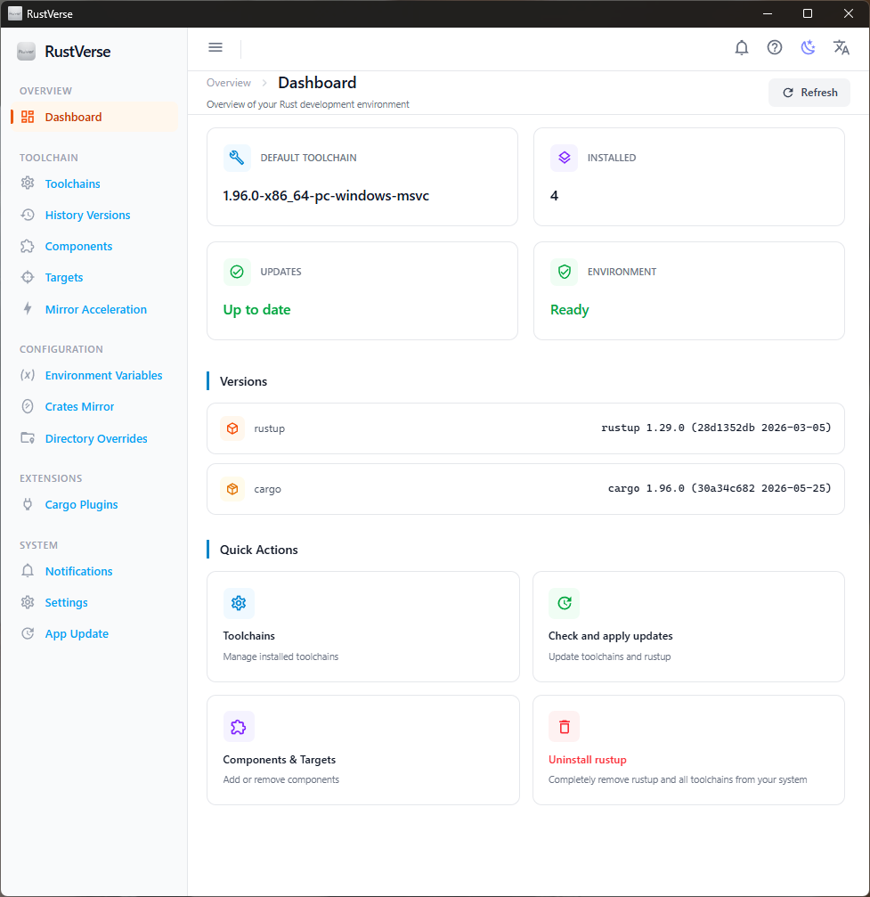
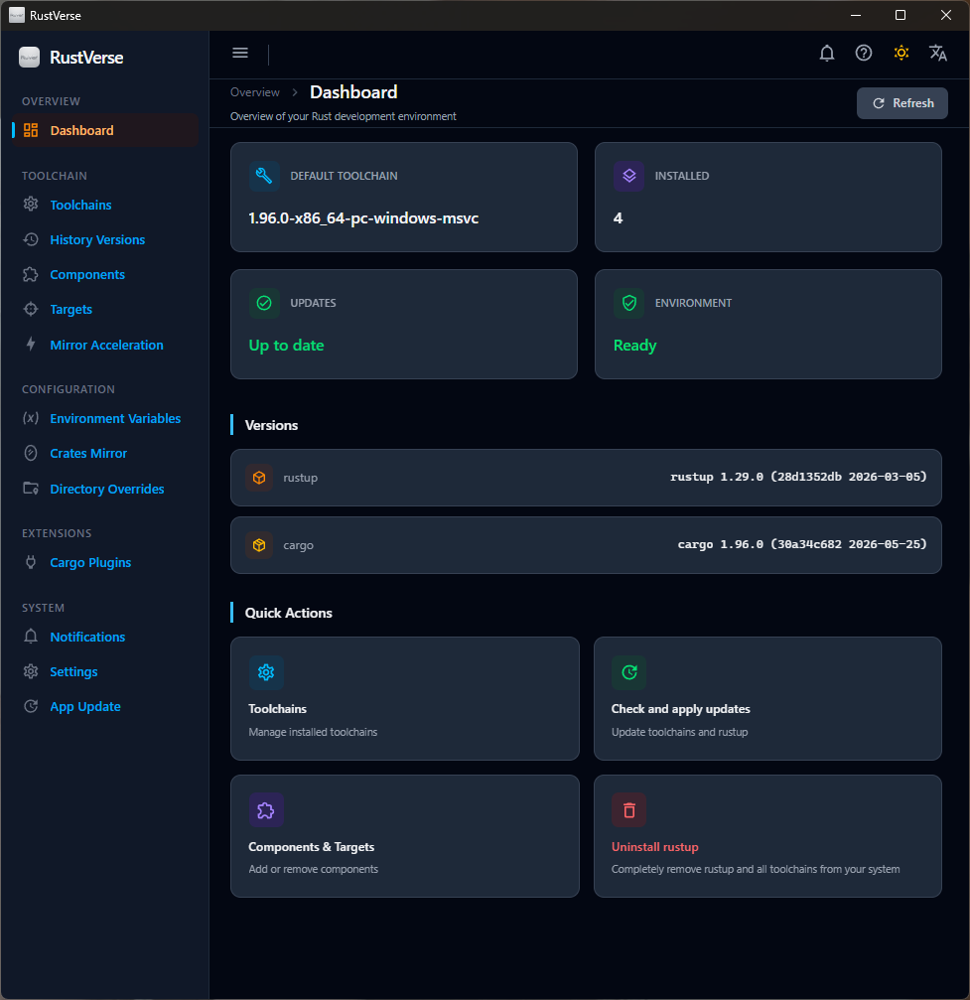
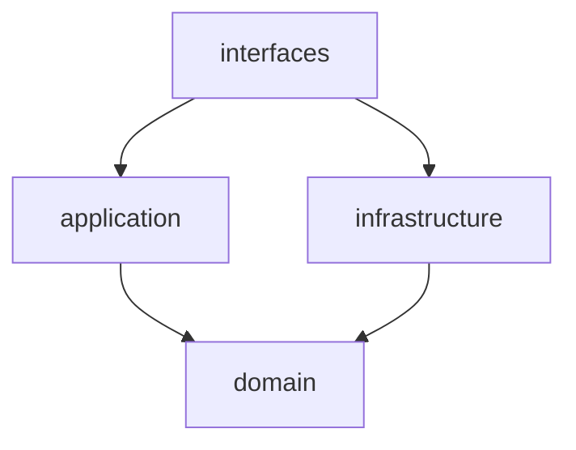

# RustVerse

> **v1.4.0** — Visual Rust Toolchain Manager

RustVerse is a cross-platform desktop application for visually managing Rust toolchains, components, targets, and Cargo plugins — all in one place. Built with **Tauri 2** + **Vue 3** + **TypeScript** + **Tailwind CSS 4**, combining Rust's system-level performance with a modern web frontend experience.

---

## Preview

> 📸 Application screenshots are stored in the [`public/imgs/`](../public/imgs/) directory. To replace screenshots, simply overwrite the corresponding files — no changes to the document structure are required.

| Light Theme | Dark Theme |
|:---:|:---:|
|  |  |

---

## Core Features

### Toolchain Management
- Install, uninstall, and switch between **stable** / **beta** / **nightly** toolchains
- Set the default toolchain and apply per-directory overrides
- Built-in release history browser with filtering by channel and date range

### Component & Target Management
- Add or remove standard components such as **rustfmt**, **clippy**, and **miri** per toolchain
- Install, search, and filter cross-compilation targets with one-click add/remove

### Mirror Source Management
- **Crates Mirror** — Integrates the `crm` tool to manage crates.io mirror sources, with automatic optimal switching and latency benchmarking
- **Rustup Mirror** — Manage rustup toolchain download mirror sources, with built-in popular Chinese mirrors

### Environment Variables & PATH
- View, set, and persist environment variables
- **CARGO_HOME** is automatically added to the system PATH, ensuring consistency between terminal and GUI environments

### Update Center
- Toolchain updates with streaming progress display; update **rustup itself** or **all toolchains** independently
- In-app automatic updates with version checking, download progress, and one-click installation

### Notifications & Background Tasks
- Global notification center with read/unread markers and automatic cleanup of expired notifications
- Background task management with minimize-to-tray support

### System Integration
- System tray icon with configurable minimize-to-tray behavior
- Automatic detection of rustup / cargo environment status at startup
- Internationalization: **Simplified Chinese** / **English**
- Dark / Light theme switching

---

## Tech Stack

| Layer | Technology |
|:---|:---|
| Desktop Framework | Tauri 2.11 |
| Frontend Framework | Vue 3.5 + TypeScript 6.0 |
| Build Tool | Vite 8 |
| Styling | Tailwind CSS 4 |
| State Management | Pinia 3 |
| Internationalization | Vue I18n 11 |
| Backend Language | Rust (edition 2024) |
| Database | redb 4.1 (embedded key-value store) |
| Async Runtime | Tokio 1.52 |

---

## Prerequisites

| Dependency | Minimum Version | Notes |
|:---|:---|:---|
| [Node.js](https://nodejs.org/) | ≥ 20 | Frontend runtime |
| [pnpm](https://pnpm.io/) | ≥ 9 | Package manager |
| [Rust](https://rustup.rs/) | stable | Backend compilation |
| [rustup](https://rustup.rs/) | — | Runtime dependency (for toolchain management) |
| [Tauri 2 Prerequisites](https://tauri.app/start/prerequisites/) | — | Platform-specific build toolchains |

---

## Quick Start

```sh
# Install dependencies
pnpm install

# Start the development server
pnpm tauri dev
```

---

## Available Commands

| Command | Description |
|:---|:---|
| `pnpm tauri dev` | Start dev server with hot reload |
| `pnpm tauri build` | Build desktop installer packages |
| `pnpm test` | Run frontend unit tests (Vitest) |
| `pnpm test:e2e` | Run end-to-end tests (Playwright) |
| `pnpm type-check` | TypeScript type checking |
| `pnpm check` | Run `cargo check` on the backend |
| `pnpm build` | Build frontend only (for Vite preview) |
| `pnpm bump` | Synchronize version across all config files |

---

## Building & Distribution

```sh
pnpm tauri build
```

Generated installers are located in `src-tauri/target/release/bundle/`:

| Platform | Format |
|:---|:---|
| Windows | NSIS installer (`.exe`) with Chinese/English language selector |
| macOS | `.dmg` / `.app` |
| Linux | `.deb` / `.AppImage` |

### Build Signing

Auto-update artifact signing is enabled by default. When building locally without a signing key, follow these steps:

```sh
# 1. Generate a signing key pair
node scripts/generate-signer-key.cjs

# 2. Set the environment variable
$env:TAURI_SIGNING_PRIVATE_KEY = "<paste-private-key-here>"

# 3. Build
pnpm tauri build
```

Alternatively, temporarily disable auto-update signing by setting `bundle.createUpdaterArtifacts` to `false` in `src-tauri/tauri.conf.json`.

---

## Auto Update

The application integrates `tauri-plugin-updater` for automatic updates with signature verification.

### Release Workflow

```sh
# Full release (with version bump and signing)
node scripts/push-release.cjs [version]

# Dry run (no actual changes)
node scripts/push-release.cjs --dry-run

# Skip version bump
node scripts/push-release.cjs --skip-bump
```

Configure the GitHub Secret **`TAURI_SIGNING_PRIVATE_KEY`** in your CI environment.

---

## Project Structure

```
rustverse/
├── src/                              # Frontend (Vue 3 + TypeScript)
│   ├── components/                   # Reusable UI components (18)
│   │   ├── BaseButton.vue            #   Base button
│   │   ├── ConfirmDialog.vue         #   Confirmation dialog
│   │   ├── ProgressDialog.vue        #   Progress dialog
│   │   ├── SplashScreen.vue          #   Splash screen
│   │   ├── Toast.vue                 #   Toast notification
│   │   ├── TopBar.vue                #   Top navigation bar
│   │   ├── PageLayout.vue            #   Page layout wrapper
│   │   ├── ToolchainSelector.vue     #   Toolchain selector
│   │   ├── BackgroundTaskOverlay.vue #   Background task overlay
│   │   ├── DatePicker.vue            #   Date picker
│   │   ├── DateRangePicker.vue       #   Date range picker
│   │   ├── EmptyState.vue            #   Empty state placeholder
│   │   ├── SearchInput.vue           #   Search input
│   │   ├── StatusBadge.vue           #   Status badge
│   │   ├── SectionTitle.vue          #   Section title
│   │   ├── LatencyBar.vue            #   Latency bar chart
│   │   ├── HelpPanel.vue             #   Help panel
│   │   └── ListItem.vue              #   List item
│   ├── composables/                  # Composable functions (18)
│   │   ├── useAppStore.ts            #   App state management
│   │   ├── useAppUpdater.ts          #   App auto-update
│   │   ├── useBackgroundTask.ts      #   Background task management
│   │   ├── useCalendar.ts            #   Calendar grid generation
│   │   ├── useDataRefresh.ts         #   Auto-refresh data polling
│   │   ├── useEnvVars.ts             #   Environment variable operations
│   │   ├── useError.ts               #   Error handling
│   │   ├── useHistoryVersions.ts     #   Historical version queries
│   │   ├── useLogger.ts              #   Frontend logging bridge
│   │   ├── useMirror.ts              #   Crates mirror management
│   │   ├── usePersist.ts             #   Persistent state
│   │   ├── useResponsiveListHeight.ts#   Responsive list height
│   │   ├── useRustup.ts              #   Rustup invocation wrapper
│   │   ├── useSmoothScroll.ts        #   Smooth scrolling
│   │   ├── useTerminalReinit.ts      #   Terminal environment reload
│   │   ├── useToast.ts               #   Toast notification state
│   │   ├── useToolchainOptions.ts    #   Toolchain option helpers
│   │   └── useWithTimeout.ts         #   Operation timeout wrapper
│   ├── locales/                      # i18n translations (zh-CN / en)
│   ├── views/                        # Page components (16)
│   │   ├── DashboardView.vue         #   Dashboard
│   │   ├── WelcomeView.vue           #   Onboarding welcome screen
│   │   ├── ToolchainListView.vue     #   Toolchain list
│   │   ├── HistoryVersionView.vue    #   Release history
│   │   ├── ComponentsView.vue        #   Component management
│   │   ├── TargetsView.vue           #   Target management
│   │   ├── OverrideView.vue          #   Directory overrides
│   │   ├── PluginsView.vue           #   Cargo plugins
│   │   ├── EnvVarsView.vue           #   Environment variables
│   │   ├── MirrorView.vue            #   Crates mirror
│   │   ├── RustupMirrorView.vue      #   Rustup mirror
│   │   ├── UpdateView.vue            #   Update center
│   │   ├── AppUpdateView.vue         #   App software update
│   │   ├── SettingsView.vue          #   System settings
│   │   ├── NotificationCenter.vue    #   Notification center
│   │   └── HelpView.vue              #   Help page
│   ├── App.vue                       # Root component (sidebar layout)
│   ├── router.ts                     # Route config (13 routes)
│   ├── store.ts                      # Pinia global store
│   └── main.ts                       # App entry point
├── src-tauri/                        # Backend (Rust + Tauri 2)
│   └── src/
│       ├── interfaces/               # Interface layer — Tauri command adapters
│       │   └── commands/             #   50+ registered commands
│       ├── application/              # Application layer — use case orchestration
│       ├── domain/                   # Domain layer — core business logic
│       │   ├── entity.rs             #   Domain entities
│       │   ├── repository.rs         #   Repository trait definitions
│       │   ├── settings.rs           #   User settings model
│       │   ├── notification.rs       #   Notification model
│       │   ├── error.rs              #   Error types
│       │   └── constants.rs          #   Constants
│       ├── infrastructure/           # Infrastructure layer
│       │   ├── db.rs                 #   redb database layer
│       │   ├── json_store.rs         #   JSON store implementation
│       │   ├── logger.rs             #   Structured logging
│       │   ├── proxy.rs              #   Proxy configuration
│       │   ├── pool.rs               #   Connection pool
│       │   ├── http_client.rs        #   HTTP client
│       │   └── ...
│       ├── state.rs                  # App global state
│       ├── lib.rs                    # Plugin registration & command export
│       └── main.rs                   # Entry point
├── scripts/                          # Build & release scripts
│   ├── bump-version.cjs              #   Version synchronization
│   ├── generate-locale-config.cjs    #   Locale config generation
│   ├── generate-latest-json.cjs      #   Update manifest generation
│   ├── generate-signer-key.cjs       #   Signing key generation
│   └── push-release.cjs              #   Automated release workflow
├── tests/                            # Tests
│   ├── unit/                         #   Unit tests (Vitest, 11 files)
│   ├── e2e/                          #   End-to-end tests (Playwright)
│   └── setup/                        #   Test setup & mocks
├── docs/                             # Project documentation
│   ├── index.html                    #   Project homepage
│   ├── architecture.md               #   Technical architecture
│   ├── requirements.md               #   Requirements document
│   └── progress.md                   #   Feature implementation checklist
└── package.json
```

---

## Backend Architecture

The backend follows a **Domain-Driven Design (DDD)** four-layer architecture with inward dependency direction:



- **interfaces** — Tauri command handlers that adapt frontend calls into application-layer operations
- **application** — Use case orchestration, coordinating domain objects and infrastructure
- **domain** — Pure business logic: entities, repository traits, error types
- **infrastructure** — Concrete implementations: database, HTTP client, logging, proxy

Over **50 Tauri commands** are registered, covering toolchains, components, targets, plugins, mirrors, environment variables, settings, notifications, updates, and more.

---

## Testing

### Frontend Unit Tests

```sh
pnpm test
```

### Backend Tests

```sh
cargo test --manifest-path src-tauri/Cargo.toml
```

### End-to-End Tests

```sh
pnpm test:e2e
```

---

## Changelog

See [CHANGES.md](../CHANGES.md) for the full release history, or visit [GitHub Releases](https://github.com/RyenLee/rust-verse/releases).

---

## License

[MIT](../LICENSE)

---

## 中文说明

RustVerse is a cross-platform desktop application for visually managing Rust toolchains, components, targets, and Cargo plugins.

### Feature Overview

| Feature | Description |
|:---|:---|
| Toolchain Management | Install, uninstall, switch stable/beta/nightly toolchains; browse release history |
| Release History | Filter historical toolchain releases by channel and date range |
| Component Management | Add/remove rustfmt, clippy, miri, and other components per toolchain |
| Targets | Install, search, and filter cross-compilation targets |
| Directory Overrides | Set per-directory toolchain version overrides |
| Cargo Plugins | Install and uninstall cargo subcommands |
| Environment Variables | View, set, persist environment variables; CARGO_HOME auto PATH management |
| Crates Mirror | Integrate crm to manage crates.io mirror sources with auto-optimal switching |
| Rustup Mirror | Manage rustup toolchain download mirror sources |
| Auto Update | In-app updates with version check, download progress, and one-click install |
| Notification Center | Global notifications with read/unread markers and auto-cleanup |
| System Tray | Minimize to tray, continue running in background |
| Internationalization | Simplified Chinese / English |
| Theme | Dark / Light theme switching |

### Quick Start

```sh
pnpm install
pnpm tauri dev
```

### Build Signing

```sh
node scripts/generate-signer-key.cjs
$env:TAURI_SIGNING_PRIVATE_KEY = "<private-key-content>"
pnpm tauri build
```

### Changelog

For detailed release notes, see [CHANGES.md](../CHANGES.md#chinese).