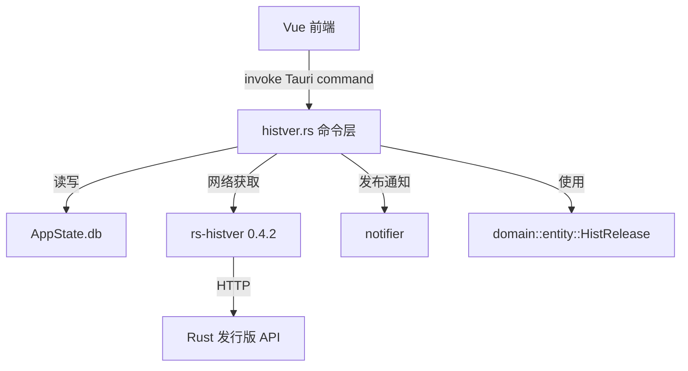
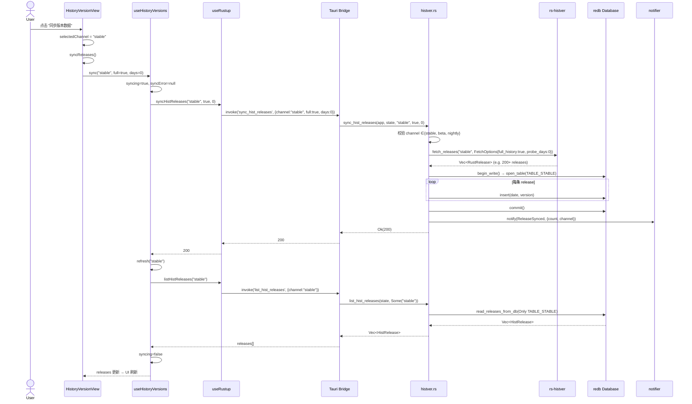
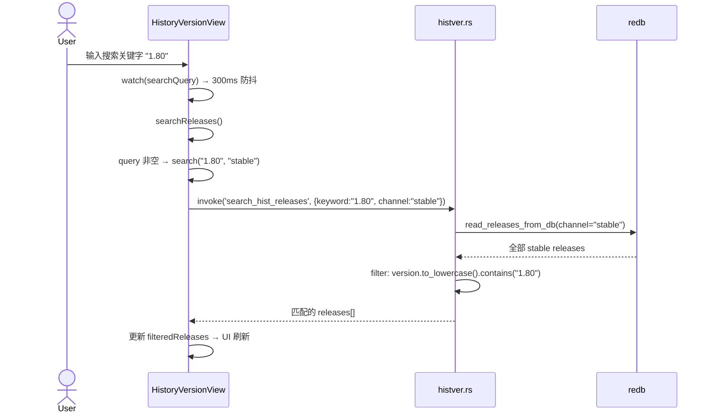
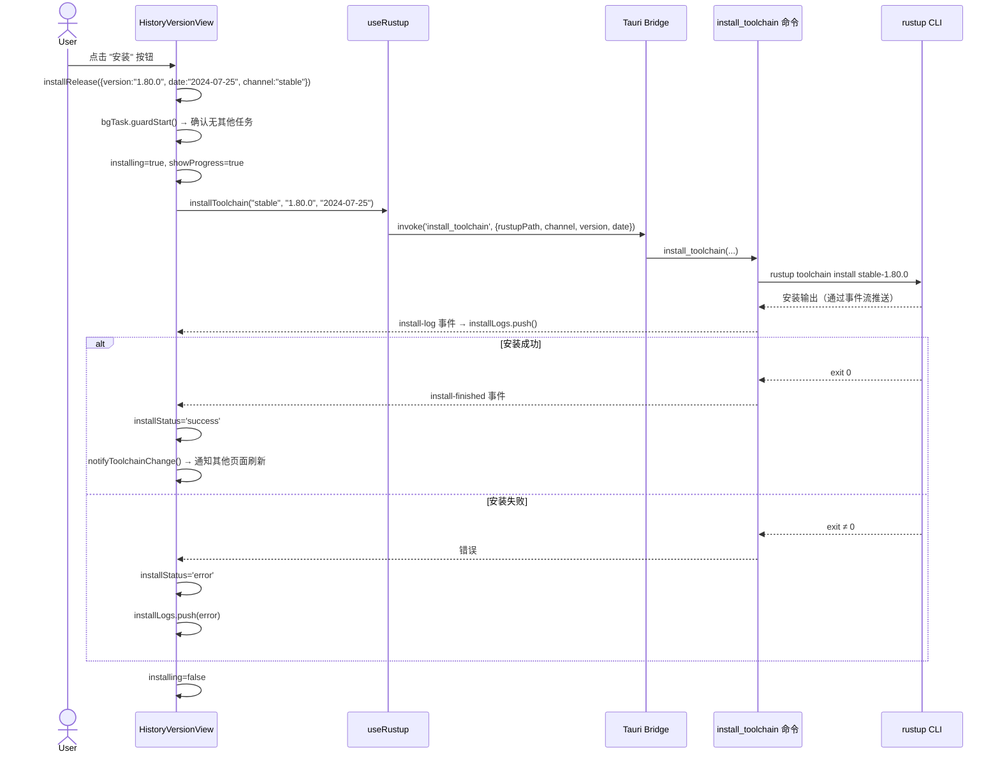

# 历史版本（History Versions）功能完整流程文档

> 生成时间：2026-05-29  
> 相关模块：`histver` | rs-histver 0.4.2 | redb 4.x

---

## 一、功能概述

历史版本功能提供 Rust 发行版（stable / beta / nightly）的**历史数据浏览、搜索、离线缓存和一键安装**能力。用户可在 `HistoryVersionView` 页面查看各频道的所有历史发行版，同步远程数据到本地 redb 数据库，搜索特定版本号，并按日期筛选。每个版本可直接触发 `rustup` 安装。

### 核心能力
- **三种频道**：Stable、Beta、Nightly，各自独立管理
- **远程同步**：通过 `rs-histver` v0.4.2 从 Rust 官方服务器获取发行版元数据
- **本地缓存**：数据持久化到主应用 redb 数据库，离线可用
- **客户端搜索/筛选**：版本号搜索 + 日期范围筛选，全部在 Vue 端实时计算
- **一键安装**：选中历史版本可直接调用 rustup 安装对应工具链
- **安装状态检测**：自动比对已安装的 toolchain，标记"已安装"状态

---

## 二、架构分层

```
┌───────────────────────────────────────────────────────────┐
│  前端 (Presentation)                                       │
│  src/views/HistoryVersionView.vue                         │
│  src/composables/useHistoryVersions.ts                     │
│  src/composables/useRustup.ts                              │
├───────────────────────────────────────────────────────────┤
│  接口层 (Interfaces)                                       │
│  src-tauri/src/interfaces/commands/histver.rs              │
│  src-tauri/src/lib.rs (命令注册)                            │
├───────────────────────────────────────────────────────────┤
│  领域层 (Domain)                                           │
│  src-tauri/src/domain/entity.rs ── HistRelease             │
│  src-tauri/src/domain/error.rs ── AppError, AppResult      │
│  src-tauri/src/domain/notification.rs ── 通知机制          │
├───────────────────────────────────────────────────────────┤
│  基础设施层 (Infrastructure)                               │
│  redb Database (主应用数据库，3 张 histver 表)              │
│  rs-histver v0.4.2 ── fetch_releases() 网络请求            │
│  src-tauri/src/state.rs ── AppState.db                     │
└───────────────────────────────────────────────────────────┘
```

**依赖方向**（全部向内）：



---

## 三、模块详解

### 3.1 前端层

#### 路由入口

| 路由 | 组件 | 说明 |
|------|------|------|
| `/history-versions` | [HistoryVersionView.vue](file:///d:/Dev/workspace/2026/05/Rust/rustverse/src/views/HistoryVersionView.vue) | 历史版本主页 |
| `?from=toolchains` | 同上（selectMode） | 从工具链页跳入的"选择模式" |

导航注册于 [App.vue:L160](file:///d:/Dev/workspace/2026/05/Rust/rustverse/src/App.vue#L160)，路由定义在 [router.ts:L17-L19](file:///d:/Dev/workspace/2026/05/Rust/rustverse/src/router.ts#L17-L19)。

#### `useHistoryVersions` ([useHistoryVersions.ts](file:///d:/Dev/workspace/2026/05/Rust/rustverse/src/composables/useHistoryVersions.ts))

| 方法 | 说明 | 调用后端命令 |
|------|------|------------|
| `sync(channel, full, days)` | 触发远程同步 → 存储 → 刷新列表 | `sync_hist_releases` |
| `refresh(channel?)` | 从本地 DB 加载列表 | `list_hist_releases` |
| `search(keyword, channel?)` | 在本地 DB 中按版本号搜索 | `search_hist_releases` |
| `count(channel?)` | 统计本地 DB 中的记录数 | `count_hist_releases` |
| `installFromHistory(ch, ver, date)` | 安装历史版本工具链 | `install_toolchain` |

状态管理：
- `releases: Ref<HistRelease[]>` — 当前展示的发行版列表
- `loading: Ref<boolean>` — 列表加载状态
- `syncing: Ref<boolean>` — 远程同步进行中
- `syncError: Ref<string | null>` — 同步错误信息

#### `useRustup` 中的 histver 部分 ([useRustup.ts:L192-L247](file:///d:/Dev/workspace/2026/05/Rust/rustverse/src/composables/useRustup.ts#L192-L247))

封装 `invoke` 调用，将 Tauri command 映射为 TypeScript 异步函数：

```typescript
export interface HistRelease {
  version: string
  date: string
  channel: string
}

syncHistReleases(channel, full, days)    → invoke<number>('sync_hist_releases', ...)
listHistReleases(channel?)               → invoke<HistRelease[]>('list_hist_releases', ...)
searchHistReleases(keyword, channel?)    → invoke<HistRelease[]>('search_hist_releases', ...)
countHistReleases(channel?)              → invoke<number>('count_hist_releases', ...)
```

#### `HistoryVersionView.vue` 核心交互

| 用户操作 | 触发流程 |
|---------|---------|
| 页面加载 | `onMounted` → `refresh(selectedChannel)` → `list_hist_releases` |
| 切换频道 tab | `watch(selectedChannel)` → `refresh` → 从本地 DB 按频道加载 |
| 点击"同步版本数据" | `syncReleases()` → `syncHistReleases` → `refresh` |
| 搜索框输入 | 300ms 防抖 → `searchReleases()` → `search_hist_releases` 或 `refresh` |
| 日期范围筛选 | `filteredReleases` 计算属性 → 前端内存过滤 |
| 点击"安装" | `installRelease()` → `install_toolchain` → 显示进度对话框 |
| 已安装判断 | `isInstalled(rel)` → 遍历 `toolchains` 列表匹配 version/date |

---

### 3.2 接口层 — Tauri 命令

文件：[histver.rs](file:///d:/Dev/workspace/2026/05/Rust/rustverse/src-tauri/src/interfaces/commands/histver.rs)

#### 命令注册 ([lib.rs:L16-L17](file:///d:/Dev/workspace/2026/05/Rust/rustverse/src-tauri/src/lib.rs#L16-L17), [L411-L414](file:///d:/Dev/workspace/2026/05/Rust/rustverse/src-tauri/src/lib.rs#L411-L414))

```rust
use interfaces::commands::histver::{
    count_hist_releases, list_hist_releases, search_hist_releases, sync_hist_releases,
};
// ...
.invoke_handler(tauri::generate_handler![
    sync_hist_releases,
    list_hist_releases,
    search_hist_releases,
    count_hist_releases,
    // ...
])
```

#### `sync_hist_releases` — 远程同步

```
签名: async fn(app: AppHandle, state: State<AppState>, channel: String, full: bool, days: u32) -> AppResult<u64>
```

**执行流程：**

```
1. 校验 channel ∈ {stable, beta, nightly}
       │
2. fetch_releases(&channel, FetchOptions::new()
       .full_history(full)
       .probe_days(days))
       │  ── rs-histver 0.4.2 纯网络 fetch
       │  ── 从 Rust 官方 release API 获取数据
       │  ── 返回 Vec<RustRelease> { version, date, channel }
       │
3. 空数据检查 → 返回 Network 错误
       │
4. 写入本地 redb ← state.db
       ├── 按 channel 选择对应表:
       │     "stable"  → TABLE_STABLE  ("rs_histver_stable")
       │     "beta"    → TABLE_BETA    ("rs_histver_beta")
       │     "nightly" → TABLE_NIGHTLY ("rs_histver_nightly")
       │
       ├── 开写事务 → 遍历 releases:
       │     table.insert(r.date, r.version)
       │     Key: date (YYYY-MM-DD)  Value: version (e.g. "1.80.0")
       │
       └── 提交事务
       │
5. 发布通知 → notifier::notify(
       Category::Operation, Priority::Low,
       NotificationKey::ReleaseSynced,
       params: { count, channel },
       route: "/history-versions")
       │
6. 返回 count: u64
```

**错误处理详情：**

| 错误类型 | 触发条件 | 用户提示 |
|---------|---------|---------|
| `AppError::Command` | channel 不是 stable/beta/nightly | 明确告知有效值 |
| `AppError::Network` + DNS | 域名解析失败 | 检查网络连接或 DNS 设置 |
| `AppError::Network` + Timeout | 请求超时 | 服务器可能较慢，稍后重试 |
| `AppError::Network` + TLS | 证书错误 | 系统时钟或根证书可能过期 |
| `AppError::Network` + Refused | 连接被拒 | 服务器可能宕机 |
| `AppError::Network` | API 返回空数据 | 数据源暂时不可用 |
| `AppError::Command` | redb 写事务失败 | 详细的 redb 错误信息 |

**参数含义：**
- `full: bool` — stable 频道传 `true` 获取全量历史；beta/nightly 传 `false`
- `days: u32` — stable 频道传 `0`（不限天数）；beta/nightly 传 `90` 天

#### `list_hist_releases` — 本地列表

```
签名: fn(state: State<AppState>, channel: Option<String>) -> AppResult<Vec<HistRelease>>
```

从本地 redb 读取。若指定 channel，只读一张表；否则遍历 3 张表并标记每条记录的 channel 字段。

```
read_releases_from_db(&state.db, channel)
  ├── channel=Some("stable") → 只迭代 TABLE_STABLE
  ├── channel=None          → 迭代所有 3 张表
  │
  └── 每条记录转换为 HistRelease {
        version ← value.value(),
        date    ← key.value(),
        channel ← 当前迭代的表名对应的频道名
      }
```

#### `search_hist_releases` — 版本号搜索

```
签名: fn(state: State<AppState>, keyword: String, channel: Option<String>) -> AppResult<Vec<HistRelease>>
```

先通过 `read_releases_from_db` 加载全量数据，再在内存中按 `keyword.to_lowercase()` 匹配 `r.version.to_lowercase().contains()`。

> **注意**：搜索在服务端 Rust 侧完成，而非前端。前端 `searchQuery` watcher 触发 `search()` → 调用 `search_hist_releases` → 替换 `releases` 列表。

#### `count_hist_releases` — 记录计数

```
签名: fn(state: State<AppState>, channel: Option<String>) -> AppResult<u64>
```

加载全量数据后返回 `releases.len()`。

---

### 3.3 领域层

#### `HistRelease` ([entity.rs:L119-L124](file:///d:/Dev/workspace/2026/05/Rust/rustverse/src-tauri/src/domain/entity.rs#L119-L124))

```rust
#[derive(Debug, Clone, Serialize)]
pub struct HistRelease {
    pub version: String,  // e.g. "1.80.0" 或 "nightly 2024-07-25"
    pub date: String,     // e.g. "2024-07-25" (YYYY-MM-DD)
    pub channel: String,  // "stable" | "beta" | "nightly"
}
```

- 序列化后作为 JSON 响应返回前端
- `channel` 字段由后端读取时从表名推断，不再依赖网络返回数据

#### 错误类型 ([error.rs](file:///d:/Dev/workspace/2026/05/Rust/rustverse/src-tauri/src/domain/error.rs))

| 枚举变体 | 说明 | 序列化为前端 |
|---------|------|------------|
| `AppError::Command(msg)` | 命令参数错误、DB 操作失败 | `{ kind: "command", message }` |
| `AppError::Network(msg)` | 网络/I/O 错误 | `{ kind: "network", message }` |
| `AppError::Config(msg)` | 配置错误 | `{ kind: "config", message }` |

#### 通知机制 ([notification.rs](file:///d:/Dev/workspace/2026/05/Rust/rustverse/src-tauri/src/domain/notification.rs))

同步完成时发送通知：
```rust
notifier::notify(
    &app,
    Category::Operation,           // 操作事件类
    Priority::Low,                  // 低优先级
    NotificationKey::ReleaseSynced, // "release_synced"
    &[("count", &count_str), ("channel", &channel)],
    Some("/history-versions"),      // 点击跳转到历史页面
);
```

---

### 3.4 基础设施层

#### redb 数据库 schema

使用主应用数据库（[AppState.db](file:///d:/Dev/workspace/2026/05/Rust/rustverse/src-tauri/src/state.rs#L27)），3 张 per-channel 表：

| 表名 | 说明 | Key 类型 | Key 示例 | Value 类型 | Value 示例 |
|------|------|---------|---------|-----------|----------|
| `rs_histver_stable` | Stable 频道发行版 | date (`&str`) | `"2024-07-25"` | version (`&str`) | `"1.80.0"` |
| `rs_histver_beta` | Beta 频道发行版 | date (`&str`) | `"2024-07-20"` | version (`&str`) | `"1.80.0-beta.1"` |
| `rs_histver_nightly` | Nightly 频道发行版 | date (`&str`) | `"2024-07-25"` | version (`&str`) | `"nightly 2024-07-25"` |

```rust
const TABLE_STABLE: TableDefinition<&str, &str> = TableDefinition::new("rs_histver_stable");
const TABLE_BETA: TableDefinition<&str, &str> = TableDefinition::new("rs_histver_beta");
const TABLE_NIGHTLY: TableDefinition<&str, &str> = TableDefinition::new("rs_histver_nightly");
```

**设计决策：**
- 表名硬编码（`TableDefinition` 要求编译期 `&'static str`）
- Key = date, Value = version，与原始 rs-histver 库的 schema 一致
- 每次 `sync` 写入**全量覆盖**同频道数据（同名 Key 会被覆盖）
- 数据存储在**主应用数据库**中，不再使用独立文件

#### rs-histver v0.4.2 调用

依赖声明：[Cargo.toml:L47](file:///d:/Dev/workspace/2026/05/Rust/rustverse/src-tauri/Cargo.toml#L47) — `rs-histver = "0.4.2"`

v0.4.2 是**纯网络 fetch 库**（无数据库、无文件系统），相比 v0.3.0 的主要变更：

- 架构重构为策略模式（`ReleaseFetcher` trait + `create_fetcher()`），代码量从 1155 行精简至 639 行
- `RustRelease` 新增 `channel` 字段（`{ version, date, channel }`）
- 移除 `redb`/`toml` 库依赖，库 crate 仅作纯网络 fetch
- 默认 `probe_days` 从 90 天调整为 30 天
- v0.4.2 将 `DEFAULT_TIMEOUT_SECS` 从 15s 提升到 **60s**，更好地兼容中国大陆等网络较慢地区访问 GitHub

本地项目提供自己的 redb 存储层（3 张表），与库完全解耦：

```rust
use rs_histver::{fetch_releases, FetchOptions};

let releases = fetch_releases(
    "stable",
    FetchOptions::new()
        .full_history(true)    // 获取全部历史（stable 用）
        .probe_days(0),        // 不限天数
).await?;
// releases: Vec<RustRelease> { version, date, channel }
```

`FetchOptions` 配置项：

| 方法 | 类型 | 默认值 (v0.4.2) | 默认值 (v0.3.0) | 说明 |
|------|------|--------|--------|------|
| `full_history(bool)` | `bool` | `false` | `false` | 是否获取全部历史 |
| `probe_days(u32)` | `u32` | `30` | `90` | 向前探测天数 |
| `timeout(Duration)` | `Duration` | `60s` | `30s` | 请求超时 |
| `max_concurrency(usize)` | `usize` | `10` | `5` | 最大并发请求数 |
| `user_agent(&str)` | `&str` | 默认 UA | 默认 UA | 自定义 User-Agent |

> **适配说明**：项目使用的 `fetch_releases(channel, FetchOptions::new().full_history(full).probe_days(days))` 签名与 v0.4.2 完全兼容。`RustRelease` 新增的 `channel` 字段不影响现有代码（项目按表名自行维护 channel）。beta/nightly 探测天数仍由上层传参 `90` 覆盖默认值 `30`。

---

## 四、完整调用时序

### 4.1 同步流程



### 4.2 搜索流程



### 4.3 安装流程



---

## 五、数据流总览

```
┌──────────────────────────────────────────────────────────────────┐
│                        数据来源                                   │
│                                                                  │
│   Rust 官方 Release API                                          │
│   (via rs-histver 0.4.2 HTTP fetch)                              │
│                                                                  │
│          │ fetch_releases(channel, FetchOptions)                  │
│          ▼                                                       │
│   ┌──────────────────┐                                           │
│   │  Vec<RustRelease> │  { version, date, channel }              │
│   └────────┬─────────┘                                           │
│            │ 写入 (by channel)                                    │
│            ▼                                                      │
│   ┌──────────────────────────────────────────────────────┐       │
│   │           主应用 redb Database (AppState.db)           │       │
│   │                                                       │       │
│   │  rs_histver_stable  ─── key:date → val:version       │       │
│   │  rs_histver_beta    ─── key:date → val:version       │       │
│   │  rs_histver_nightly ─── key:date → val:version       │       │
│   │  ... 其他应用表 ...                                   │       │
│   └────────┬─────────────────────────────────────────────┘       │
│            │ 读取 (list/search/count)                             │
│            ▼                                                      │
│   ┌──────────────────┐                                           │
│   │ Vec<HistRelease>  │  { version, date, channel }              │
│   └────────┬─────────┘                                           │
│            │ Tauri IPC (JSON)                                     │
│            ▼                                                      │
│   ┌──────────────────────────────────────────────────────┐       │
│   │              Vue 前端 (HistoryVersionView)            │       │
│   │                                                       │       │
│   │  releases: Ref<HistRelease[]>                         │       │
│   │      │                                                │       │
│   │      ├── filteredReleases (日期筛选 + 搜索过滤)       │       │
│   │      ├── groupedReleases  (按 channel 分组)           │       │
│   │      └── isInstalled()    (匹配本地 toolchain)        │       │
│   └──────────────────────────────────────────────────────┘       │
│                                                                  │
│   用户交互:                                                       │
│     • 安装按钮 → install_toolchain 命令 → rustup CLI              │
│     • "选择"按钮 → 跳转 /toolchains?channel=xxx                   │
└──────────────────────────────────────────────────────────────────┘
```

---

## 六、错误处理矩阵

| 层级 | 错误场景 | 处理方式 | 用户可见 |
|------|---------|---------|---------|
| 前端 | `sync_hist_releases` 网络失败 | `extractErrorMessage()` 解析 → 设置 `syncError` ref → 渲染红色错误横幅 | 错误横幅 + "检查网络连接" 提示 |
| 前端 | `list_hist_releases` DB 读取失败 | 静默捕获，`releases` 保持空数组 | 显示 EmptyState "暂无版本数据" |
| 前端 | `search_hist_releases` 失败 | 静默捕获 | 列表不变 |
| 前端 | `install_toolchain` 失败 | `installStatus='error'` + 日志显示 | 进度对话框显示 "安装失败" |
| 后端 | 无效 channel 参数 | `AppError::Command` → 400 Bad Request | 前端解析 message 显示 |
| 后端 | rs-histver 网络失败 | `AppError::Network` + 场景化提示（DNS/Timeout/TLS/Refused） | 前端 `syncError` 显示 |
| 后端 | API 返回空数据 | `AppError::Network` "No release data found" | 前端 `syncError` 显示 |
| 后端 | redb 写事务失败 | `AppError::Command` + redb 底层错误 | 前端 `syncError` 显示 |
| 后端 | redb 读事务失败 | `AppError::Command` | 前端静默 → 空列表 |

---

## 七、关键文件索引

| 文件 | 路径 | 职责 |
|------|------|------|
| HistoryVersionView.vue | [src/views/](file:///d:/Dev/workspace/2026/05/Rust/rustverse/src/views/HistoryVersionView.vue) | 历史版本页面 UI + 交互逻辑 |
| useHistoryVersions.ts | [src/composables/](file:///d:/Dev/workspace/2026/05/Rust/rustverse/src/composables/useHistoryVersions.ts) | 前端状态管理 + 业务编排 |
| useRustup.ts (histver部分) | [src/composables/useRustup.ts#L192-L247](file:///d:/Dev/workspace/2026/05/Rust/rustverse/src/composables/useRustup.ts#L192-L247) | Tauri command 封装 |
| histver.rs | [src-tauri/src/interfaces/commands/](file:///d:/Dev/workspace/2026/05/Rust/rustverse/src-tauri/src/interfaces/commands/histver.rs) | 后端 4 个 Tauri 命令实现 |
| entity.rs (HistRelease) | [src-tauri/src/domain/entity.rs#L119-L124](file:///d:/Dev/workspace/2026/05/Rust/rustverse/src-tauri/src/domain/entity.rs#L119-L124) | 领域实体定义 |
| error.rs | [src-tauri/src/domain/error.rs](file:///d:/Dev/workspace/2026/05/Rust/rustverse/src-tauri/src/domain/error.rs) | AppError + AppResult 类型 |
| state.rs | [src-tauri/src/state.rs](file:///d:/Dev/workspace/2026/05/Rust/rustverse/src-tauri/src/state.rs) | AppState.db 主数据库引用 |
| notification.rs | [src-tauri/src/domain/notification.rs](file:///d:/Dev/workspace/2026/05/Rust/rustverse/src-tauri/src/domain/notification.rs) | ReleaseSynced 通知定义 |
| lib.rs | [src-tauri/src/lib.rs#L16-L17](file:///d:/Dev/workspace/2026/05/Rust/rustverse/src-tauri/src/lib.rs#L16-L17) | 命令注册 |
| Cargo.toml | [src-tauri/Cargo.toml#L47](file:///d:/Dev/workspace/2026/05/Rust/rustverse/src-tauri/Cargo.toml#L47) | rs-histver = "0.4.2" |
| histver i18n (zh-CN) | [src/locales/zh-CN/histver.ts](file:///d:/Dev/workspace/2026/05/Rust/rustverse/src/locales/zh-CN/histver.ts) | 中文翻译 |
| histver i18n (en) | [src/locales/en/histver.ts](file:///d:/Dev/workspace/2026/05/Rust/rustverse/src/locales/en/histver.ts) | 英文翻译 |
| router.ts | [src/router.ts#L17-L19](file:///d:/Dev/workspace/2026/05/Rust/rustverse/src/router.ts#L17-L19) | `/history-versions` 路由 |

---

## 八、扩展指南

### 添加新的发行版数据源

1. 修改 `histver.rs` 中的网络获取逻辑，替换或包裹 `rs_histver::fetch_releases`
2. 如需新的频道（如 `dev`），添加新的 `TableDefinition` 常量和新表名
3. 更新 `ALL_CHANNELS` 静态数组
4. 前端 `channelOptions` 添加新 tab

### 添加缓存过期策略

当前每次 `sync` 全量覆盖同频道数据。可扩展为：
1. 在 redb 中添加元数据表记录最后同步时间
2. `refresh` 时检查缓存时效，过期则自动触发 `sync`
3. 或在前端添加"上次同步时间"显示

### 添加分页支持

当前全量加载。大频道（stable 200+ 条）可考虑：
1. 后端添加 `list_hist_releases` 的 `offset`/`limit` 参数
2. redb `range()` + `skip()` 游标分页
3. 前端改为按需加载（scroll 触发）